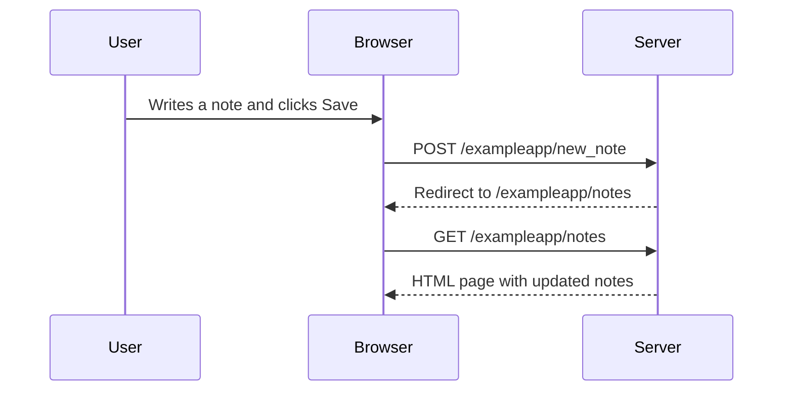
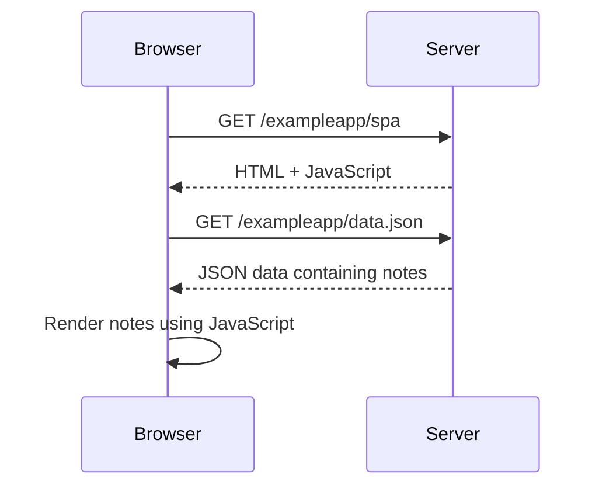
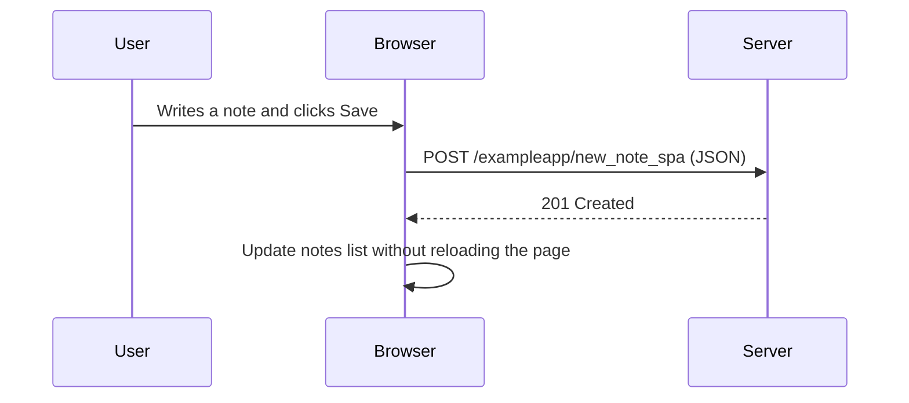

## 0.4: New note (traditional web app)

```mermaid
sequenceDiagram
    participant User
    participant Browser
    participant Server

    User->>Browser: Writes a note and clicks Save
    Browser->>Server: POST /exampleapp/new_note
    Server-->>Browser: Redirect to /exampleapp/notes
    Browser->>Server: GET /exampleapp/notes
    Server-->>Browser: HTML page with updated notes
```

## 0.5: Single page app

```mermaid
sequenceDiagram
    participant Browser
    participant Server

    Browser->>Server: GET /exampleapp/spa
    Server-->>Browser: HTML + JavaScript

    Browser->>Server: GET /exampleapp/data.json
    Server-->>Browser: JSON data containing notes

    Browser->>Browser: Render notes using JavaScript
```

## 0.6: New note in Single page app

```mermaid
sequenceDiagram
    participant User
    participant Browser
    participant Server

    User->>Browser: Writes a note and clicks Save
    Browser->>Server: POST /exampleapp/new_note_spa (JSON)
    Server-->>Browser: 201 Created
    Browser->>Browser: Update notes list without reloading the page
```
